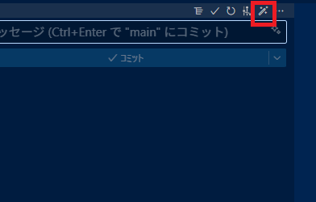
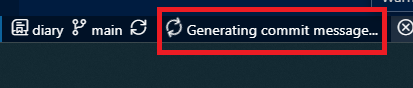

[To English Version README](README.md)

# コミットメッセージジェネレーター (by Gemini CLI)

リポジトリの変更から Conventional Commits 形式のコミットメッセージを自動生成して、ソース管理の入力欄へ挿入する VS Code 拡張です。  
Gemini CLIxが動作する環境であれば、利用可能です。  
GitHub Copilot が使えない環境でも手軽に使えます。

## 使い方

- ソース管理ビューのボタンから実行:
  - コミット入力欄のツールバー、または「ソース管理」タイトルバーのツールバー  
   
  - 実行中はステータスバーにスピナーが表示されます  
    
- コマンドパレットから実行:
  - 「Commit message generation by gemini cli」
  - ID: `commit-message-gene-by-gemini-cli.runGeminiCLICmd`
  - 「Commit message generation」と入力して検索
- 完了すると、生成結果がコミットメッセージ入力欄に自動で入ります。

## 要件

- Windows 10/11（バンドルされるヘルパーは Windows 用）
- Gemini CLI をグローバルインストールし、`%APPDATA%\npm\gemini.cmd` が存在すること
- VS Code の組み込み Git 拡張が有効であること
- 出力の確認は Output パネル「commit message gene」

## ライセンス

MIT License © 2025 komiyamma
