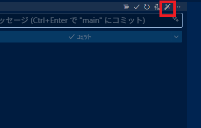
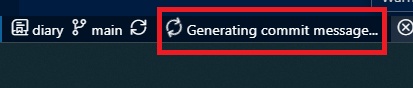

[To Japanese Version README](README.ja.md)

# Commit Message Generator (by Gemini CLI)

This VSCode extension automatically generates a Conventional Commits-style commit message from repository changes and inserts it into the Source Control input box.  
It piggybacks on Gemini CLI authentication handled by `@google/gemini-cli-core`, so no API key is required.  
It’s handy even where GitHub Copilot isn’t available.

## How to Use

- Run from the Source Control view button:
  - Commit input box toolbar, or the Source Control title bar toolbar  
   
  - While running, a spinner is shown in the status bar  
    
- Run from the Command Palette:
  - "Commit message generation by gemini cli"
  - ID: `commit-message-gene-by-gemini-cli.runGeminiCLICmd`
  - Search by typing "Commit message generation"
- When finished, the generated result is automatically inserted into the commit message input box.

## Requirements

- VS Code with Git available in the workspace
- Gemini CLI sign-in is available through the core package, or Application Default Credentials are configured in Cloud Shell / GCE-style environments
- Gemini CLI stores its auth state under `~/.gemini` by default, or under `%GEMINI_CLI_HOME%/.gemini` if `GEMINI_CLI_HOME` is set
- Built-in VSCode Git extension is enabled
- Check output in the Output panel "commit message gene"

## License

MIT License © 2025 komiyamma
