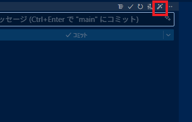
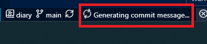

[To Japanese Version README](README.ja.md)

# Commit Message Generator (by Gemini CLI)

This VS Code extension automatically generates a Conventional Commits-style commit message from repository changes and inserts it into the Source Control input box.  
If Gemini CLI runs in your environment, you can use this extension.  
It’s handy even where GitHub Copilot isn’t available.

## How to Use

- Run from the Source Control view button:
  - Commit input box toolbar, or the Source Control title bar toolbar  
   
  - While running, a spinner is shown in the status bar  
    
- Run from the Command Palette:
  - "Commit message generation by gemini cli"
  - ID: `commit-message-gene-by-gemini-cli.runGeminiCLICmd`
  - Search by typing "Commit message generation"
- When finished, the generated result is automatically inserted into the commit message input box.

## Requirements

- Windows 10/11 (the bundled helper targets Windows)
- Install Gemini CLI globally so `%APPDATA%\npm\gemini.cmd` exists
- Built-in VS Code Git extension is enabled
- Check output in the Output panel "commit message gene"

## License

MIT License © 2025 komiyamma

